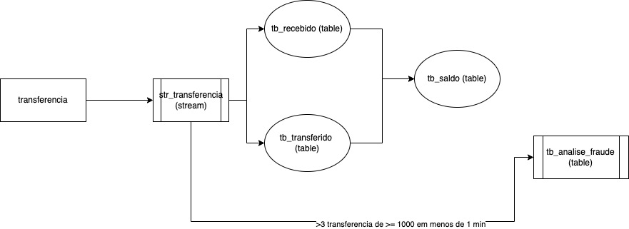

## O que iremos construir ? 
Para cada transferência bancária iremos calcular o saldo do cliente, dado as tranferências que ele fez e que recebeu. Além disso iremos analisar se dentro de uma janela de 1 minuto ele realizou pelo menos 3 transferências de 1000 reais ou mais, cada uma. 

## Pré-Requisitos
Você precisa subir o docker-compose através do arquivo `docker-compose.yml` presente na raiz deste repositório.

## Passo a passo 
1) criar stream para ler as transferencias:
      
    `CREATE STREAM str_transferencia (clientid STRING KEY, clientid_destino STRING, valor DOUBLE)
      WITH (kafka_topic='transferencia', value_format='json', partitions=1);`

2) criar table tb_recebidos lendo da stream str_transferencia onde a key é cliente_id_destino e sumarizar os valores , assim sabemos quanto cada cliente recebeu.

    `CREATE TABLE tb_recebido AS SELECT clientid_destino, sum(valor) as total_recebido FROM str_transferencia GROUP BY clientid_destino EMIT CHANGES; `

3) criar table tb_transferido onde a key é a propria key da str_transferencia e sumarizar os valores , assim sabemos quanto cada cliente transferiu. 

    `CREATE TABLE tb_transferido AS SELECT clientid, sum(valor) as total_transferido FROM str_transferencia GROUP BY clientid EMIT CHANGES; `

4) Criar table tb_saldo para ler de tb_recebidos e tb_transferidos , realizar a subtração de (recebidos - transferidos), com isso temos o total.

    `CREATE TABLE tb_saldo AS SELECT t.clientid, sum(r.total_recebido - t.total_transferido) as saldo
    FROM tb_transferido t JOIN tb_recebido r on t.clientid = r.clientid_destino GROUP BY t.clientid EMIT CHANGES;`

5) inicializa os clientes (1,2,3), todos zerados

    `INSERT INTO tb_transferido (clientid, total_transferido) values ('1',0);`

    `INSERT INTO tb_transferido (clientid, total_transferido) values ('2',0);`

    `INSERT INTO tb_transferido (clientid, total_transferido) values ('3',0);`

    `INSERT INTO tb_recebido (clientid_destino, total_recebido) values ('1',0);`

    `INSERT INTO tb_recebido (clientid_destino, total_recebido) values ('2',0);`

    `INSERT INTO tb_recebido (clientid_destino, total_recebido) values ('3',0);`

6) Captura mais de 3 transferencias acima ou igual a 1000 partindo do mesmo cliente e envia para a tabela de fraudes

    `CREATE TABLE tb_analise_fraude
    AS SELECT clientid, sum(valor) as total_transferido, TIMESTAMPTOSTRING(WINDOWSTART, 'yyyy-MM-dd HH:mm:ss.SSS') as starttime, 
    TIMESTAMPTOSTRING(WINDOWEND, 'yyyy-MM-dd HH:mm:ss.SSS') as endtime 
    FROM str_transferencia
    WINDOW SESSION (60 SECONDS) 
    WHERE valor >= 1000
    GROUP BY clientid 
    HAVING COUNT (*) >= 3 EMIT CHANGES;`

### Testes

- Testa o saldo (realize os inserts abaixo para testar o saldo final de cada cliente)

    `INSERT INTO str_transferencia(clientid, clientid_destino, valor) values ('1', '2', 100);`

    `INSERT INTO str_transferencia(clientid, clientid_destino, valor) values ('1', '3', 50);`

    `INSERT INTO str_transferencia(clientid, clientid_destino, valor) values ('3', '2', 100);`

- Testa a fraude (realize os inserts abaixo, e veja mensagens chegando no tópico de fraudes), ou use um `push query: select * from tb_analise_fraude emit changes;`

    `INSERT INTO str_transferencia(clientid, clientid_destino, valor) values ('1', '2', 1000);`

    `INSERT INTO str_transferencia(clientid, clientid_destino, valor) values ('1', '2', 1200);`

    `INSERT INTO str_transferencia(clientid, clientid_destino, valor) values ('1', '2', 1300);`

